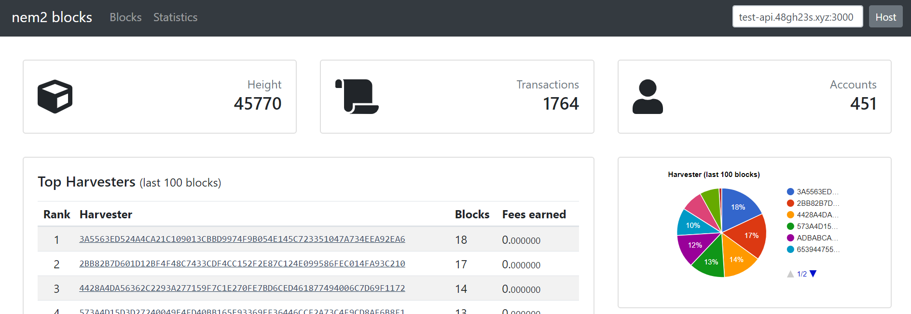
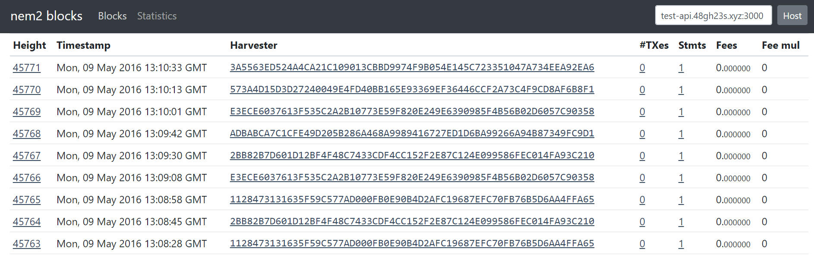
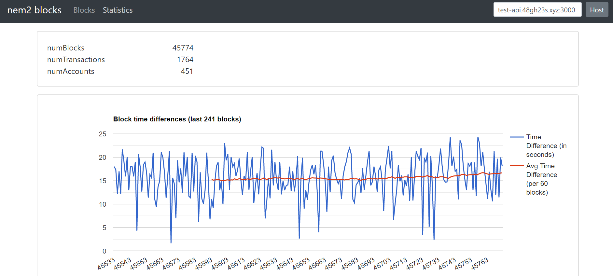

# nem2-blocks

- compatible with fushicho3
- only block information

[demo](https://test-block.48gh23s.xyz)





## Build Setup

``` bash
# install dependencies
$ npm run install

# serve with hot reload at localhost:3000
$ npm run dev

# generate static project
$ npm run generate
```

For detailed explanation on how things work, check out [Nuxt.js docs](https://nuxtjs.org).
